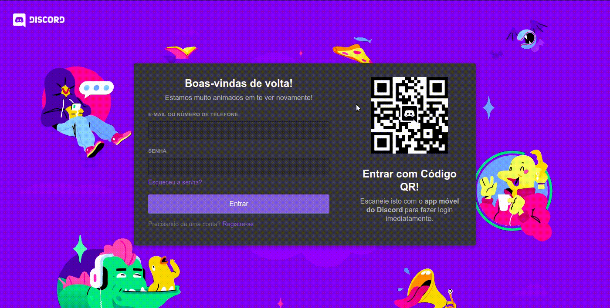
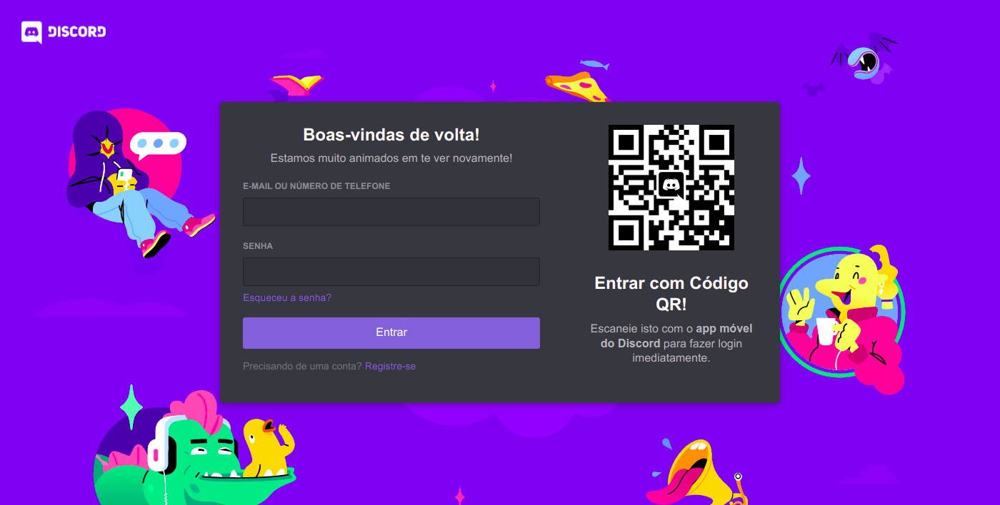

# Clone da Tela de Login do Discord com Animação.

Clone da página de login do Discord com algumas mudanças, adição da logo na parte superior esquerda e de uma animação.

Veja prints e GIFs, tecnologias usadas e como executar o app em seu computador.

## Prints e GIFs

### 1. GIF da Animação



### 2. Prints

##### 2.1 Desktop



##### 2.2 Tablet


##### 2.3 Mobile


## Tecnologias Usadas

1. React JS
2. TypeScript
3. Styled Components
4. Keyframes
5. QRCode React

## Instruções para Execução.

1. Baixe ou clone o repositório;
2. Caso tenha baixado, extraia o arquivo;
3. Entre na pasta e abra o terminal, ou navegue pelo terminal até ela;
4. Execute o comando de instalação de dependências:
   ```bash
   npm install
   # or
   yarn install
   ```
5. Execute o comando para executar o app:
   ```bash
   npm start
   # or
   yarn start
   ```
